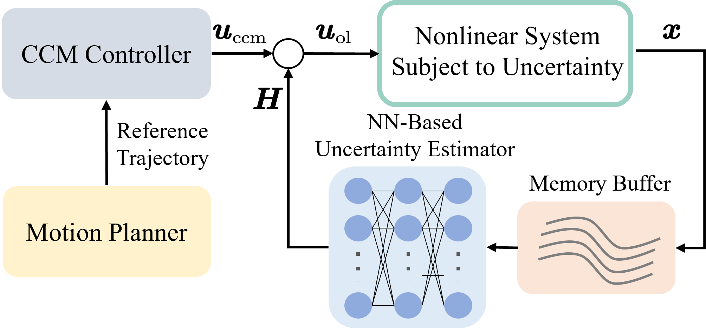

# Enhanced Robust Tracking Control: An Online Learning Approach

This repo contains the implementation code of the paper "Online Learning Enhanced CCM Tracking Performance" by Ao Jin, Weijian Zhao, Yifeng Ma, Panfeng, Huang, and Fan Zhang*.

This work focuses the tracking control problem for nonlinear systems subjected to unknown external disturbances. Inspired by contraction theory, a neural network-dirven CCM synthesis is adopted to obtain a feedback controller that could track any feasible trajectory. Based on the observation that the system states under continuous control input inherently contain embedded information about unknown external disturbances, we propose an online learning scheme that captures the disturbances dyanmics from online historical data and embeds the compensation within the CCM controller. The proposed scheme operates as a plug-and-play module that intrinsically enhances the tracking performance of CCM synthesis. The numerical simulations on tethered space robot and PVTOL demonstrate the effectiveness of proposed scheme. 

<div align="center">
    
</div>

Our paper: [Enhanced Robust Tracking Control: An Online Learning Approach](links)

## 1. Getting Started

Before running the code, install the dependency packages in a virtual python env by executing the following command:

```bash
pip install requirements.txt
```

## 2. The Main Module

* `ccm_nn`: neural networks-driven CCM synthesis
* `motion_planning`: motion planner
* `online_learning`: the proposed online scheme for capturing the unknown external disturbances
* `system`: dynamical equations of plant
* `utils`: utils for this project

## 3. Running the Code

Typical Workflow: 

* obtain the motion plan from planner
* obtain the tracking controller from neural networks-driven CCM synthesis
* track the referece trajectory with proposed controller

**The motion plans and tracking controllers have already provided. You can just execute `tracking_4_${env}.sh` to tracking reference trajectory for final results.** 

### For TSR (Tethered Space Robot)

1. Run `bash scripts/planning_4_TSR.sh` to get the motion planning. The motion planning will be located in `dump/TSR/planning`.
2. Run `bash scripts/training_4_TSR.sh` to get the tracking controller. The tracking controller and metric will be located in `dump/TSR/ccm_nn`.
3. Copy the files from `dump/TSR/planning` and `dump/TSR/ccm_nn` to `dump/TSR/OL`, and run `bash scripts/tracking_4_TSR.sh` to track the reference trajectory.

### For PVTOL

1. Run `bash scripts/planning_4_PVTOL.sh` to get the motion planning. The motion planning will be located in `dump/PVTOL/planning`.
2. Run `bash scripts/training_4_PVTOL.sh` to get the tracking controller. The tracking controller and metric will be located in `dump/PVTOL/ccm_nn`.
3. Copy the files from `dump/PVTOL/planning` and `dump/PVTOL/ccm_nn` to `dump/PVTOL/OL`,  and run `bash scripts/tracking_4_PVTOL.sh` to track the reference trajectory.

## 4. Citation

If you find this repo useful in your research, please cite our work:

```context
@misc{jin2025online_ccm,
      title={Enhanced Robust Tracking Control: An Online Learning Approach}, 
      author={Ao Jin and Weijian Zhao and Yifeng Ma and Panfeng Huang and Fan Zhang},
      year={2025},
      eprint={},
      url={}, 
}
```
